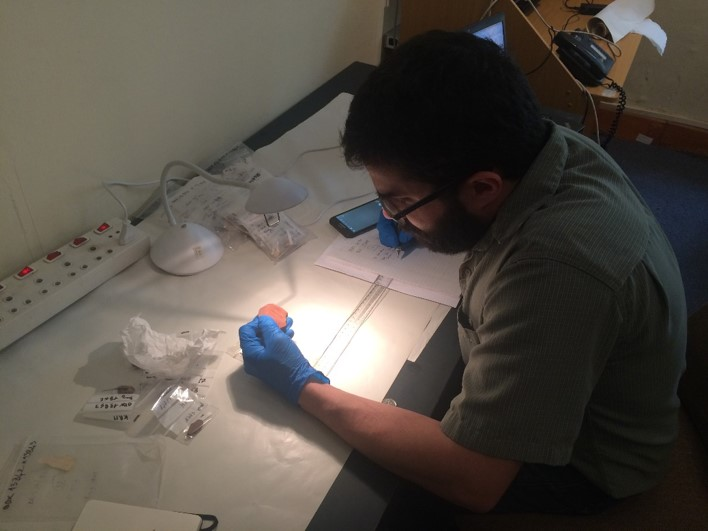
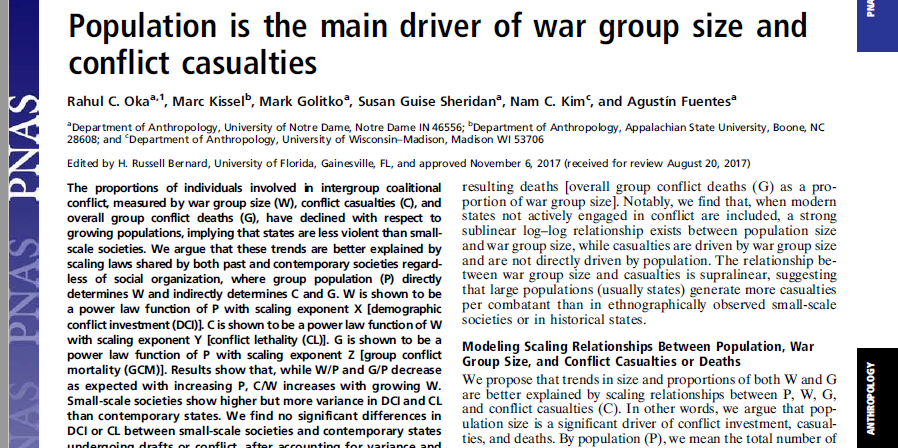

```{r setup, include=FALSE}
options(htmltools.dir.version = FALSE)
```

```{r xaringan-themer, include=FALSE}
library(xaringanthemer)
solarized_dark(
  code_font_family = "Fira Code",
  code_font_url    = "https://cdn.rawgit.com/tonsky/FiraCode/1.204/distr/fira_code.css",
  title_slide_background_image = "https://raw.githubusercontent.com/MarcKissel/Talks/master/UNLV_images/background.png",

title_slide_text_color = "#1E90FF"
)
```


```{r Setup, include=FALSE}
#i added animate.css to make animations
#see https://www.garrickadenbuie.com/blog/2018/12/03/animate-xaringan-slide-transitions/


#title_slide_background_image = "https://ssdp.org/wp-content/uploads/2018/01/app-state-blog-pic.jpg",

#packages i may need
library(tidyverse)
library(plotly)
library(leaflet)
library(knitr)
library(DT)
library(xtable)
library(kableExtra)
library(ggridges)
library(knitr)

```


name: intro
class: center, inverse

#Questions
____________________

#How did hominins become human? and why?

#What can collective violence tell us about how we became human?

#How popular science (mis)characterizes human evolution

???

## What pressures did our early ancestors face and *how* did they respond to them?

## Can these responses inform  on causes/consequences of modern human variation?
---
name: hominin_chart

class: inverse

background-image: url(images/Hominin_evo_chart.jpg)
background-size: contain


---

background-image: url(https://raw.githubusercontent.com/MarcKissel/job_talk/master/Vogleherd.png)
background-position: center
background-repeat: no-repeat
background-size: contain

--
class: middle

.pull-right[

] 
---
class: inverse
# Human Wisdom Project
###Database records all instances of human symbolic expression before ~45,000


[Worldwide Instances of Symbolic Data Outlining Modernity ](https://marckissel.shinyapps.io/wisdom_database/)


---

class: inverse

background-image: url(images/background_data_map.png)
background-size: contain


---

class: inverse

background-image: url(images/map_blombos.png)
background-size: contain


---

class: inverse

background-image: url(images/oldisblen_1.png)
background-size: contain


---


class: inverse

background-image: url(images/oldisblen_2.png)
background-size: contain


---
class: inverse

background-image: url(images/FAD_2.png)
background-size: contain
background-position: bottom 

# Izikio Musuem, Jan 2018 



---
class: inverse center

## Summary 
____________________

.left[
### Importance of open-access datasets
### Need to incorperate new models/theories 
]


???
tital to here is about 26 mins


---

class: center, inverse

#Warfare in our evolutionary past
____________________________________

---
class: center, inverse

#Warfare in our evolutionary past
____________________________________


.pull-left[

##Some argue war is very old


]
--
.pull-right[

##others think it is a product of *civilization* 

]

???

Organized aggression and violence between socially distinct or autonomous groups of people This paper

---
class: inverse, center, middle 

#When did human warfare evolve?


---
class: inverse
background-image: url(images/Types2.png)
background-size: contain
background-position: center bottom

.center[
#Types of data
]
---

class: inverse, center

# Recent debate on war group numbers

.pull-left[

]


.pull-right[

]


???
scholars have noted that in hunter-gather populations, the number of people involved in fighting ~40% of the population, but this drops in state-level societies. 

"re people in big, modern societies more or less violent than our forebears? The answer is neither, according to a controversial new study: People who lived in small bands in the past had no more proclivity toward violence than we do today. The finding—based on estimates of war casualties throughout history—undercuts the popular argument that humans have become a more peaceful species over time, thanks to advances in technology and governance. But some critics aren’t convinced.

That includes the man who most recently popularized the idea, psychologist Steven Pinker of Harvard University, who calls the new findings “a statistical gimmick.” He argues in his 2011 book The Better Angels of Our Nature: Why Violence Has Declined that the emergence of institutions like nation-states with strong central governments, trade networks, and wide-ranging communication increased interdependence and reduced deaths due to violence. He cited data suggesting that fewer people die in wars today, relative to a society’s total population, than among small tribes of hunter-gatherers, pastoralists, and horticulturalists—how human society organized for most of its history.

But a team led by anthropologist Rahul Oka at the University of Notre Dame in Indiana wondered whether there was a mathematical explanation for why fewer people proportionally are lost to violence nowadays. They reasoned that as populations get bigger, their armies don’t necessarily grow at the same rate. In a small group of 100 adults, for example, it would be perfectly reasonable to have 25 warriors, says anthropologist and study co-author Mark Golitko, also at Notre Dame. But in a population of 100 million, supporting and coordinating an army of 25 million soldiers is logistically impossible, to say nothing of such an army’s effectiveness. Researchers call that incongruity a scaling effect."


---
class: inverse

## But is it that simple?

--

##Maybe the drop is due to broader issues that appear as population size increases

--



???
33 mins

To test this collected data on population & war group size for ~300 socieites and data from speicfic historical conflicts


is this drop in the number of people involved in war (what we call the “war group”) due to the effects of living in a state or is it a reflection of broader issues that appear when population increases?
We collected data on population and war group size from 295 societies and on war group size and conflict-related casualties from 430 historical conflicts going back to 2500 B.C. We show that, as population goes up, the proportion of people involved in conflict decreases.  In other words, it is not that states prevent violence, but rather that other factors, such as the need to feed, cloth, and arm a war group makes it harder to involve a large percentage of people in more complex societies. 

---
class: inverse


```{r datatable for war and read in data, echo=FALSE, message=FALSE, warning=FALSE}
war <- read_csv("PopSizeTemp.csv") ##### or temp file?
DCI <- read_csv("X_Factor_Dataset.csv")
DCI_interact <-  DCI %>% gather(value = X, key = country, Belgium:Iraq)
DCI_summary <- DCI_interact %>% group_by(country) %>% summarise(DCI_mean = mean(X, na.rm = TRUE), DCI_sd = sd(X, na.rm = TRUE))
```

```{r code for figure 1a1, echo=FALSE, message=FALSE, warning=FALSE}
#plot_Fig1a1 <- ggplot() + geom_point(data = war, aes(x= log(Population), y = log(Overall_War_Group_Size_W), color = Time_Type))+ geom_smooth(data = war, aes(x= log(Population), y = log(Overall_War_Group_Size_W), group=1),method="lm") + geom_point(data= war, aes(x= log(Population), y = log(W.P), color = Time_Type)) + geom_smooth(data = war, aes(x= log(Population), y = log(W.P), group=1),method="lm")


plot_Fig1a1 <- ggplot() + geom_point(data = war, aes(x= log(Population), y = log(Overall_War_Group_Size_W), color = Time_Type, text = paste("Society: ", Society) ))+ geom_smooth(data = war, aes(x= log(Population), y = log(Overall_War_Group_Size_W), group=1),method="lm") + geom_point(data= war, aes(x= log(Population), y = log(W.P), color = Time_Type, text = paste("Society: ", Society))) + geom_smooth(data = war, aes(x= log(Population), y = log(W.P), group=1),method="lm") + theme(legend.position='none')

```


```{r echo=FALSE, message=FALSE, warning=FALSE}
ggplotly(plot_Fig1a1, height = 500, width = 850)
```

##The relationship between population size &  wargroup size is based on the ratio of the wargroup/population 
 

---
class: inverse 
background-image:url(images/Press_4.png) 
background-size: contain
background-position: center bottom

.center[
#Press
]
---
class: inverse 
background-image:url(images/Press_5.png) 
background-size: contain
background-position: center bottom

.center[
#Press
]

---
class: inverse

.center[
#Demographic Conflict Investment 
]
____________________________________
## We calculated  the number of individuals involved in conflict accounting for the scale in population 

--

## No difference in DCI between small-scale societies & state-level societies. 


???
Demographic conflict investment: relative measure of number of individuals involved in conflict accounting for scale in group population

The exponent X serves as a measure of how many individuals
are being committed to the unit’s war group, hereafter
known as demographic conflict investment (DCI) in relation to P.

DCI is remarkably sensitive at identifying changing conflict
needs and shows fluctuations even for small engagements,
especially in earlier periods, where personnel are the primary
investment rather than technology.
ii) Trends in DCI show some decreasing demographic investment
in conflict over time, suggesting that most modern
nations have reached optimal sizes of armies that they can
and desire to sustain at any time subject to population conflict
needs, other economic or cultural considerations, or
investments in conflict technology rather than personnel,
all of which may contribute to declining DCI.
iii) Increases in DCI at the time of major conflict are significant
indicators of conflict investment, regardless of technology, as
states tend to increase numbers of combatants in the field
during active combat. This is especially pertinent given the
lessons from the Iraq War (2003–2011), Afghanistan (2001 to
present), and Syria (2011 to present) that clearly show that
technology may not easily replace “boots-on-the-ground.”


---
class: inverse

```{r interactive plot, echo=FALSE, message=FALSE}

#setup data

DCI_interact <-  DCI %>% gather(value = X, key = country, Belgium:Iraq)


plot_DCI <- ggplot(DCI_interact, aes( x=Year, y = X, group=country, color = country)) + geom_line() + ylab("DCI")
plot_DCI <- ggplotly(plot_DCI, height = 500, width = 800)
#p

#plot_DCI %>% layout(autosize = F, width = 800, height = 800)

plot_DCI
```

#change in DCI overtime


---
name: motion_plot
class: inverse

motion plot of DCI values over time

```{r data for interactive DCI, echo=FALSE, message=FALSE, warning=FALSE}
DCI <- read_csv("X_Factor_Dataset.csv")
DCI_interact <-  DCI %>% gather(value = X, key = country, Belgium:Iraq)
DCI_summary <- DCI_interact %>% group_by(country) %>% summarise(DCI_mean = mean(X, na.rm = TRUE), DCI_sd = sd(X, na.rm = TRUE))
#setup data

DCI_motion <-ggplot(DCI_interact, aes(x= Year, y = X, group =country, frame = Year, color = country, label=country, size = X)) + geom_point() + geom_label(aes(Year, X, label=country)) 
                     

```


```{r motion plot, echo=FALSE, message=FALSE, warning=FALSE}

ggplotly(DCI_motion, height = 600, width = 800) %>% animation_opts(300, redraw = F)


```


---
name: warfare_summary
class: inverse 
## Summary

##We are not more or less violent than our forebears

##Population size is a confounding factor


???
39 mins
hey reasoned that as populations get bigger, their armies don’t necessarily grow at the same rate. In a small group of 100 adults, for example, it would be perfectly reasonable to have 25 warriors, says anthropologist and study co-author Mark Golitko, also at Notre Dame. But in a population of 100 million, supporting and coordinating an army of 25 million soldiers is logistically impossible, to say nothing of such an army’s effectiveness. Researchers call that incongruity a scaling effect.


---
class: inverse

background-image: url(UNLV_images/Picture1.png)
background-size: contain
---
class: inverse

background-image: url(UNLV_images/Picture1b.png)
background-size: contain

---

class: inverse

background-image: url(UNLV_images/Picture1c.png)
background-size: contain


---
class: inverse

background-image: url(UNLV_images/Picture3.png)
background-size: contain
---
class: inverse

background-image: url(UNLV_images/Picture4.png)
background-size: contain
---

class: inverse

background-image: url(UNLV_images/Picture5.png)
background-size: contain
---
class: inverse

background-image: url(UNLV_images/goldberg.png)
background-size: contain


---
class: inverse 

background-image: url(UNLV_images/Picture6.png)
background-size: contain
---
class: inverse

background-image: url(UNLV_images/Picture7.png)
background-size: contain
---

class: inverse

background-image: url(UNLV_images/Picture8.png)
background-size: contain
---

class: inverse

background-image: url(UNLV_images/Picture9.png)
background-size: contain
---
class: inverse

background-image: url(UNLV_images/Picture10.png)
background-size: contain
---
class: inverse

background-image: url(UNLV_images/Picture11.png)
background-size: contain
---


name: final_conclusions
class: inverse, center

# overall conclusions
____________________

.left[
## We need to think about how we frame discussions of human origins

## We need to be cognizant of the biases we bring to these questions

## There isn't one event/behavior/trait that makes us human

## Questions like these require anthropological thinking

]

---


---
class: inverse 

# Acknowledgments
_______________________
.pull-left[

- Agustin Fuentes
- John Hawks
- Debra Martin
- Celia Deane-Drummond
- Julia Feder
- Jennifer French
- Kerryn Warren
- Becky Ackermann 
- Adam Willows
- Rachel Caspari
- Holly Dunsworth
- Charles Roseman
- Milford Wolpoff
- Cara Ocobock
- Jon Marks
- Nam Kim 
- Chris Ball
- Sue Sheridan
- Michaela Howells 
]
.pull_right[

- John Templeton Foundation
- University of Notre Dame Dept. of Anthropology
- University of Nevada-Las Vegas
- University of Gibraltar
- Middle Stone Age Research Dialogue Series
- Evolution of Human Wisdom Group
- Paleoanthropology Society


]

---

---

---

class: inverse 
background-image:url(UNLV_images/MMM_1.png) 
background-size: contain
background-position: center bottom

---


class: inverse 
background-image:url(UNLV_images/MMM_2.png) 
background-size: contain
background-position: center bottom


---
name: overview
class: center, inverse

# Two areas
____________
FIX

.pull-left[
## - How did we begin to think like humans?


]
.pull-right[

## - When did collective violence evolve?


]

???
# Both have to do with how we view the world and examining the pressures our early ancestors faced

also, note:
class: center, middle

## What pressures did our early ancestors face and *how* did they respond to them?

## Can these responses inform  on causes/consequences of modern human variation?

---

name: Behavioral_Modernity_intro
class: inverse

# **Behavioral Modernity**

## Theory argues that there was a time lag between when ancestors began to *look* human and when they began to *act* human 


???


---

background-image: url(https://raw.githubusercontent.com/MarcKissel/job_talk/master/Vogleherd.png)
background-position: center
background-repeat: no-repeat
background-size: contain

--
class: middle

.pull-right[

] 

---


class: inverse

background-image: url(images/Neandertal_smart.png)
background-size: contain


---


---


class: inverse

background-image: url(images/400_plus.png)
background-size: contain
---

class: inverse

background-image: url(images/300_399.png)
background-size: contain

---
class: inverse

background-image: url(images/300_399_shell.png)
background-size: contain

---

class: inverse

background-image: url(images/200_299.png)
background-size: contain


---

class: inverse

background-image: url(images/100-199.png)
background-size: contain

---

class: inverse

background-image: url(images/45_100.png)
background-size: contain


